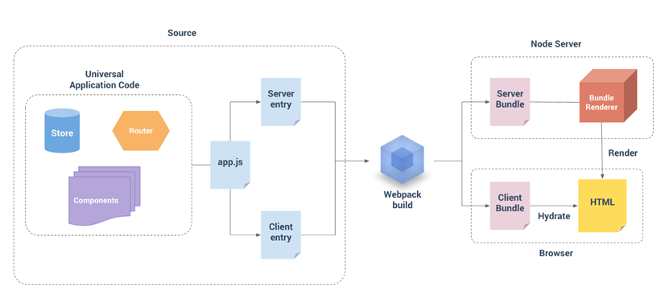

 

 

# Vue.js 服务器端渲染指南

<https://ssr.vuejs.org/zh/>



[https://ssr.vuejs.org/zh/guide/structure.html#介绍构建步骤](https://ssr.vuejs.org/zh/guide/structure.html#%E4%BB%8B%E7%BB%8D%E6%9E%84%E5%BB%BA%E6%AD%A5%E9%AA%A4)


```
npm install vue vue-server-renderer --save
```
`vue-server-renderer` 和 `vue` 必须匹配版本

 

所有的生命周期钩子函数中，只有 `beforeCreate` 和 `created` 会在服务器端渲染 (SSR) 过程中被调用。

这就是说任何其他生命周期钩子函数中的代码（例如 `beforeMount` 或 `mounted`），只会在客户端执行

大多数自定义指令直接操作 DOM，因此会在服务器端渲染 (SSR) 过程中导致错误

[https://ssr.vuejs.org/zh/guide/universal.html#组件生命周期钩子函数](https://ssr.vuejs.org/zh/guide/universal.html#%E7%BB%84%E4%BB%B6%E7%94%9F%E5%91%BD%E5%91%A8%E6%9C%9F%E9%92%A9%E5%AD%90%E5%87%BD%E6%95%B0)

 

 

为每个请求创建一个新的根 Vue 实例

[https://ssr.vuejs.org/zh/guide/structure.html#避免状态单例](https://ssr.vuejs.org/zh/guide/structure.html#%E9%81%BF%E5%85%8D%E7%8A%B6%E6%80%81%E5%8D%95%E4%BE%8B)

 

 

**数据预取**

在路由组件中放置数据预取逻辑

我们将在路由组件上暴露出一个自定义静态函数 `asyncData`

在 `entry-server.js` 中，我们可以通过路由获得与 `router.getMatchedComponents()` 相匹配的组件，如果组件暴露出 `asyncData`，我们就调用这个方法

然后我们需要将解析完成的状态，附加到渲染上下文(render context)中。

// 状态将自动序列化为 `window.__INITIAL_STATE__`，并注入 HTML  
context.state = store.state  
<https://ssr.vuejs.org/zh/guide/data.htmlhttps://ssr.vuejs.org/zh/guide/data.html>  

 

客户端数据读取, 随便找个钩子, 钩子中调用 `asyncData`:  
beforeResolve         (路由切换时就准备好数据)  
beforeMount          (挂载前才加载数据, 路由切换快)  
beforeRouteUpdate     (路由有变化时也加载数据, 栗子: /usr/1 => /usr/2)  

 

 

若是用beforeResolve钩子, 应该在router onReady之后再注册beforeResolve, 在beforeResolve里面使用 `asyncData`

(避免第一次resolve时重复加载服务端加载过的数据, 但后续每次resolve时仍使用 `asyncData` 加载数据)

 

 

**store 拆分**

我们可以在路由组件的 `asyncData` 钩子函数中，使用 `store.registerModule` 惰性注册(lazy-register)这个模块

由于模块现在是路由组件的依赖，所以它将被 webpack 移动到路由组件的异步 chunk 中

 

 

 

`vue-server-renderer` 提供一个名为 `createBundleRenderer` 的 API

 

 

# Nuxt.js

<https://nuxtjs.org/>  

 

 

 

# Annex

 

官方综述

<https://cn.vuejs.org/v2/guide/ssr.html>  

 

 

Vue.js 服务器端渲染指南

<https://ssr.vuejs.org/zh/>  

 

官方栗子

<https://github.com/vuejs/vue-hackernews-2.0/>  

 

 

 

NUXT

一个基于vue.js的服务端渲染应用框架

<https://zh.nuxtjs.org/>  

 

 

 

 

 