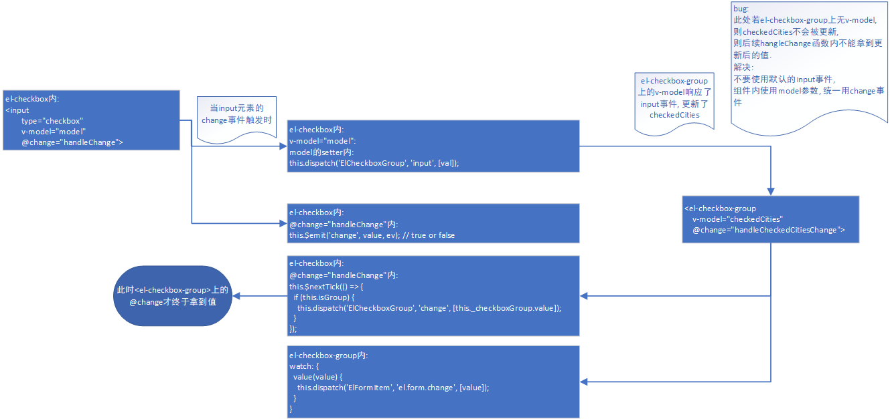

## 问题情况

element-ui version: 2.13.0

使用 `<el-checkbox-group>` 时遇到一个问题

```html
<el-checkbox-group :value="checkedCities" @change="handleCheckedCitiesChange">
```

`handleCheckedCitiesChange` 中无法正确获取更新后的值

用 `v-model` 绑定的方式能正常响应, `:value + @change` 就不行

效果见 <https://codepen.io/chess126/pen/rNaeNYb?&editable=true>

相关文档 <https://element.eleme.cn/#/zh-CN/component/checkbox>


## 相关源码分析

element-ui 源码的 checkbox.vue 中:  

v-model绑定了一个变量 `model` 

```html
      <input
          class="el-checkbox__original"
          type="checkbox"
          :aria-hidden="indeterminate ? 'true' : 'false'"
          :disabled="isDisabled"
          :value="label"
          :name="name"
          v-model="model"
          @change="handleChange"
          @focus="focus = true"
          @blur="focus = false">
```


`model` 自定义了getter和setter, 当 `el-checkbox` 是在 `el-checkbox-gourp` 下时, `model` 即和 `el-checkbox` 最近的一个祖先 `el-checkbox-group` 的 `value` 属性是同一个引用

isGroup则 model -> store -> this._checkboxGroup.value

```javascript
    computed: {
      model: {
        get() {
          return this.isGroup
            ? this.store : this.value !== undefined
              ? this.value : this.selfModel;
        },

        set(val) {
          console.log('checkbox model set', val);
          if (this.isGroup) {
            this.isLimitExceeded = false;
            (this._checkboxGroup.min !== undefined &&
              val.length < this._checkboxGroup.min &&
              (this.isLimitExceeded = true));

            (this._checkboxGroup.max !== undefined &&
              val.length > this._checkboxGroup.max &&
              (this.isLimitExceeded = true));

            this.isLimitExceeded === false &&
            this.dispatch('ElCheckboxGroup', 'input', [val]);
          } else {
            this.$emit('input', val);
            this.selfModel = val;
          }
        }
      },

      ...

      _checkboxGroup() {
        let parent = this.$parent;
        while (parent) {
          if (parent.$options.componentName !== 'ElCheckboxGroup') {
            parent = parent.$parent;
          } else {
            return parent;
          }
        }
        return false;
      },
      store() {
        return this._checkboxGroup ? this._checkboxGroup.value : this.value;
      },

      ...
    }
```


v-model的默认行为是绑定的 `input` 事件和 `value` 值

> 默认情况下，一个组件上的 `v-model` 会把 `value` 用作 prop 且把 `input` 用作 event，但是一些输入类型比如单选框和复选框按钮可能想使用 `value` prop 来达到不同的目的。使用 `model` 选项可以回避这些情况产生的冲突。 

< https://cn.vuejs.org/v2/api/#model >


```html
<input type="checkbox" v-model="model"></input>
```

> - text 和 textarea 元素使用 `value` 属性和 `input` 事件
> -  checkbox 和 radio 使用 `checked` 属性和 `change` 事件
> - select 字段将 `value` 作为 prop 并将 `change` 作为事件

 <https://cn.vuejs.org/v2/guide/forms.html >


绑了个数组上去是什么操作...  但是在 setter 里打印一下结果, 得到的确实是个数组.

实测Vue内给 checkbox 用 v-model 绑一个数组 "anArray" , 状态切换时, 会 toggle "anArray" 内的 "someValue"

`<input type="checkbox" value="someValue" v-model="anArray">` 

anArray: `["someDefaultValue", "someValue"]` <==> `["someDefaultValue"]`

戳 <https://codepen.io/chess126/pen/JjoKGWK?&editable=true>


数据流程整理如图:




## 问题总结 

官方文档上只提到了 `change` 事件, 使人以为 `<el-checkbox-group>` 上的 `v-model` 等于 `:value + @change` ,
实际 `<el-checkbox-group>` 上还有一个没在文档里提到的 `input` 事件, `v-model` 实际等于默认行为 `:value + @input` , 
而 `<el-checkbox-group>` 上的`change`只是补发出来的一个事件, 如果没有在 `@input` 或者 `v-model` 里把值更新掉, `@change` 拿到的就还是更新前的值.


## 解决方式

打算提个PR, 把 `input` 事件取消了, 用 Vue 的 `model` 属性统一改用 `change` 事件.

checkbox.spec.js 中有一个如下的测试:

```JavaScript
  it('checked', () => {
    vm = createVue({
      template: `
        <div>
          <el-checkbox v-model="checked" checked></el-checkbox>
          <el-checkbox-group v-model="checklist">
            <el-checkbox checked label="a"></el-checkbox>
          </el-checkbox-group>
        </div>
      `,
      data() {
        return {
          checked: false,
          checklist: []
        };
      }
    }, true);
    expect(vm.checked).to.be.true;
    expect(vm.checklist.indexOf('a') !== -1).to.be.true;
  });
```

原本的实现中, 同时有 `v-model="checked"` 和 `checked` 时, 用一个用户没有关注的 `input` 事件悄悄把 `checked` 变量的值改掉了,

统一改用 `change` 事件后,  初始化时若 `v-model` 的值不为true | trueLabel, 会多加一次 `change` 事件 


或者, 有没有其他好的改法..


## 补充说明

开始用 `:value + @change` 而没用 `v-model` , 是因为我这里绑定的值是从 `computed` 里来的, 想自定义 `@change` 处理值更新的方式.

这种情况下, 可以不用自定义 `@change` , 给 `computed` 的变量加一个 `setter` 就可以处理值更新的方式, 文档: [Computed Setter](https://vuejs.org/v2/guide/computed.html#Computed-Setter) 