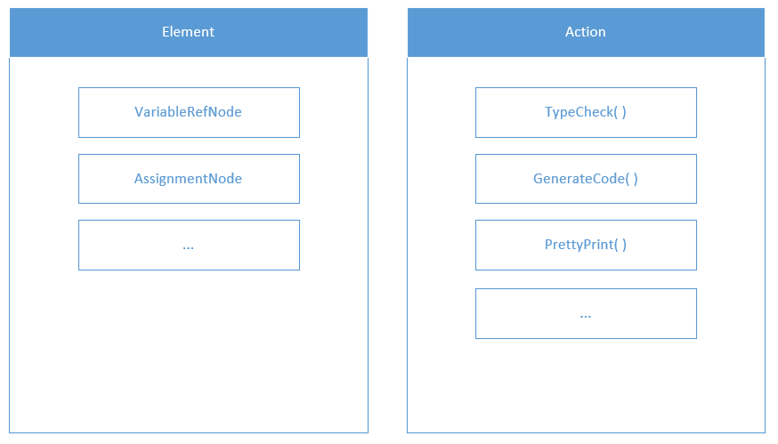
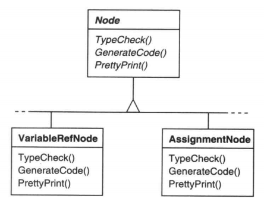
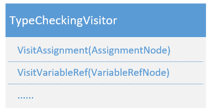
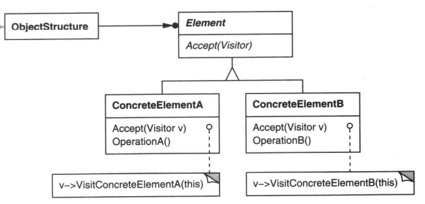

## VISITOR（访问者）

记录下简单理解, 具体详见 GoF design patterns 原书 5.11

原书讲了一个编译器的栗子

AST（Abstract Syntax Tree，抽象语法树）中有 "变量" "赋值" 等 Node 类型, 对每种 Node  可以进行 `TypeCheck` `GenerateCode` `PrettyPrint` 等各种 Action 

对于一种特定的语言,   Node 的种类基本是固定的, Action 的种类则不固定, 会想有各种各样的 Action

如果按如下方式组织程序, 则每次想添加新 Action 都要修改所有 Node 类.

所以应该把 Action 抽象出来, 把所有 Node 的同一种 Action 放在一个 Visitor 中, 之后要添加一种新的 Action 只需要添加一个新 Visitor, 而不用改已有的 Node 类

使用时, 用一个 `ObjectStructre` 管理遍历 Node, 每个 Node 都 Accept 这个 Visitor, 调用其中与自己相关的 Action.  

babel 中也用到了 Visitor 模式, 详见 [Babel 插件手册]( https://github.com/jamiebuilds/babel-handbook/blob/master/translations/zh-Hans/plugin-handbook.md )