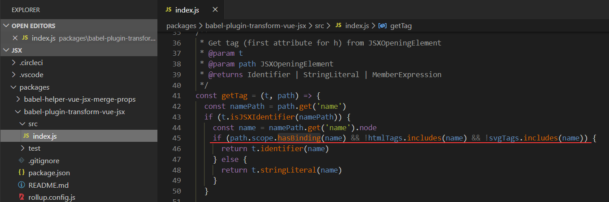
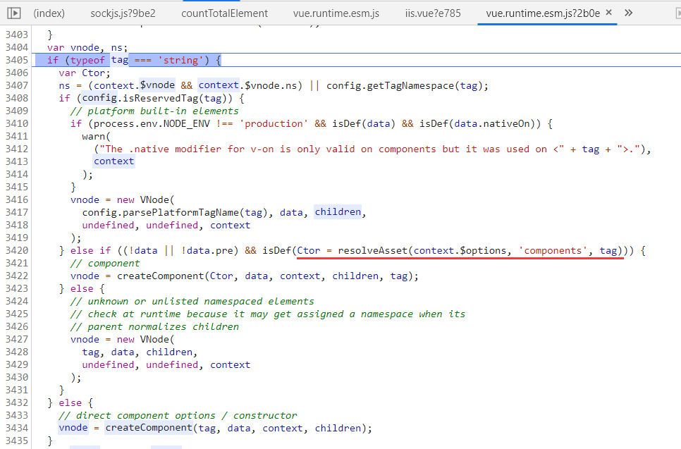
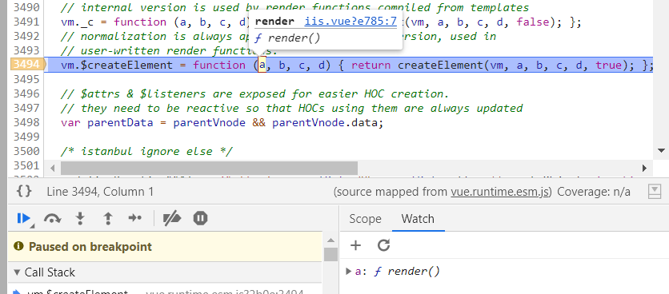
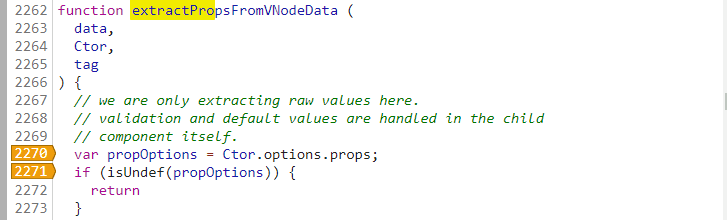
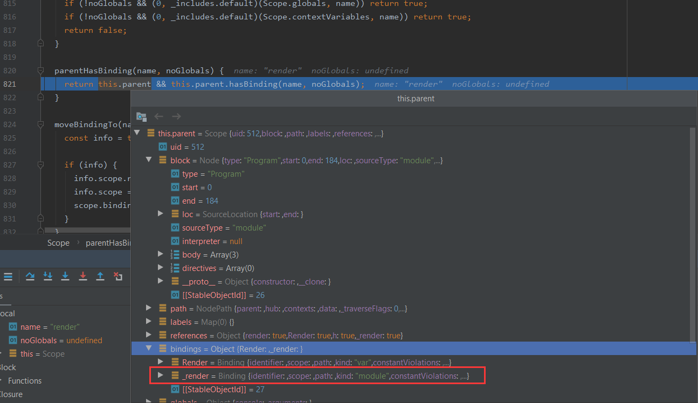
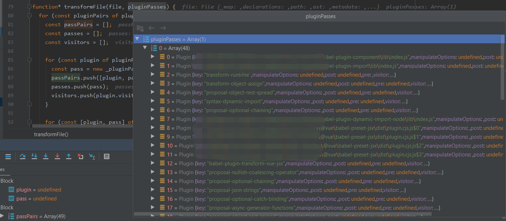

一个有点意思的报错, 深挖一下

<!-- TOC -->

- [错误复现](#错误复现)
- [不报错情形](#不报错情形)
- [报错原因分析](#报错原因分析)
- [不报错情形分析](#不报错情形分析)
- [关于命名规范](#关于命名规范)
- [扩展阅读](#扩展阅读)

<!-- /TOC -->

## 错误复现

当前环境

```
"vue": "^2.5.17"
"@babel/core": "^7.0.0",
"@babel/parser": "7.7.5",
"babel-plugin-import": "^1.11.0",
"@vue/babel-preset-jsx": "^1.1.1",
```


随便import一个组件为 `render` , 然后在 `render()` 函数中使用, 报错

```vue
<script type="text/jsx">
  import render from './list'

  export default {
    components: {
      render
    },

    render () {
      // console.log('render', render)
      return <render>1111</render>
    }
  }
</script>
```


## 不报错情形

不报错情形1:  import 为 `render` , 在模板语法`<template>` 内使用

不报错情形2: import 为 `Render` , JSX中写为 `<render>` 或 `<Render>` 都不报错

```vue
<script type="text/jsx">
  import Render from './list'

  export default {
    components: {
      Render
    },
    
    ....
```

不报错情形3: import 为 `render` 但是加了console.log

```vue
    render () {
      console.log('render', render)
      return <render>1111</render>
    }
```


## 报错原因分析

编译时通过 babel-plugin-transform-vue-jsx 把 JSXElement 转换成 h函数调用, 具体对 "tag" 的处理:
作用域中找得到就当作变量
作用域中找不到就当作字符串
(这个 "tag" 后面被作为 createElement 的第一个参数)

相关代码:



<https://github.com/vuejs/jsx/blob/dev/packages/babel-plugin-transform-vue-jsx/src/index.js#L45>  

后续Vue createElement处理时, 是构造函数直接用, 是字符串就去 components 中找




编译时作用域中有import进来的变量render, 编译成传render变量:

```JavaScript
/* harmony import */ var _list__WEBPACK_IMPORTED_MODULE_2__ = __webpack_require__(/*! ./list */ "./src/pages/tenant/list.vue");

/* harmony default export */ __webpack_exports__["default"] = ({
  components: {
    render: _list__WEBPACK_IMPORTED_MODULE_2__["default"]
  },
  render: function render() {
    var h = arguments[0];
    // console.log('render', render)
    return h(render, ["1111"]);
  }
});//# sourceURL=[module]
```


执行时就近找到了 render函数, render函数被当作了 Ctor
( 正经的 Ctor 应该是一个 VueComponent )



找不到Ctor.options.props 所以报错了:

  


编译时作用域中没有render变量, 处理成字符串, 然后去 components 里找了:

```JavaScript
  render: function render() {
    var h = arguments[0];
    // console.log('render', render)
    return h("render", ["1111"]);
  }
```


## 不报错情形分析

情形1: `<template>` 直接由 [vue-loader]( https://github.com/vuejs/vue-loader/blob/master/lib/loaders/templateLoader.js ) - [vue-template-compiler]( https://github.com/vuejs/vue/tree/dev/packages/vue-template-compiler ) 处理成render函数了, 没有经过 `babel-plugin-transform-vue-jsx` 的处理

情形2: 因为作用域中没有了 `render`, 所以处理成了 `h("render", ["1111"])`


情形3编译结果:

```JavaScript
/* harmony import */ var _list__WEBPACK_IMPORTED_MODULE_0__ = __webpack_require__(/*! ./list */ "./src/pages/tenant/list.vue");

/* harmony default export */ __webpack_exports__["default"] = ({
  components: {
    render: _list__WEBPACK_IMPORTED_MODULE_0__["default"]
  },
  render: function render() {
    var h = arguments[0];
    console.log('render', _list__WEBPACK_IMPORTED_MODULE_0__["default"]);
    return h("render", ["1111"]);
  }
});//# sourceURL=[module]
```


在 `path.scope.hasBinding(name)` 打个条件断点看看
当有 console.log 时, 处理成了 "_render", 
没有 console.log 时, 是 "render"



整个处理过程:
vue-loader => babel-loader => Webpack打包
在 babel 某一个 plugin 被处理成 "_render" 



@babel/core/lib/transformation/index.js
在 `transformFile` 函数里下条件断点 `file.opts.filename` 停到关注的文件
`file.ast` 经过每个 plugin 里的 visitor 处理变形

```javascript
(0, _traverse().default)(file.ast, visitor, file.scope);
```

@babel/traverse/lib/index.js

```JavaScript
traverse.node = function (node, opts, scope, state, parentPath, skipKeys) {
  const keys = t.VISITOR_KEYS[node.type];
  if (!keys) return;
  const context = new _context.default(scope, opts, state, parentPath);

  for (const key of keys) {
    if (skipKeys && skipKeys[key]) continue;
    if (context.visit(node, key)) return;
  }
};
```

@babel/traverse/lib/context.js

```javascript
  visit(node, key) {
    const nodes = node[key];
    if (!nodes) return false;

    if (Array.isArray(nodes)) {
      return this.visitMultiple(nodes, node, key);
    } else {
      return this.visitSingle(node, key);
    }
  }
```


## 关于命名规范

根据官方风格指南, 组件名应该使用多个单词, 可以避免命名冲突的问题
这个栗子中, 组件最好命名为 RenderFooooo, 也就不会出现这个报错了


>  **组件名应该始终是多个单词的，根组件 `App` 以及 `<transition>`、`<component>` 之类的 Vue 内置组件除外。** 
>
>  
>
>  **[单文件组件](https://cn.vuejs.org/v2/guide/single-file-components.html)的文件名应该要么始终是单词大写开头 (PascalCase)，要么始终是横线连接 (kebab-case)** 
>
>  
>
>   **应用特定样式和约定的基础组件 (也就是展示类的、无逻辑的或无状态的组件) 应该全部以一个特定的前缀开头，比如 `Base`、`App` 或 `V`。** 
>
>  
>
>   **和父组件紧密耦合的子组件应该以父组件名作为前缀命名。** 
>
>  
>
>   **对于绝大多数项目来说，在[单文件组件](https://cn.vuejs.org/v2/guide/single-file-components.html)和字符串模板中组件名应该总是 PascalCase 的——但是在 DOM 模板中总是 kebab-case 的。** 
>
>  
>
>   **JS/[JSX](https://cn.vuejs.org/v2/guide/render-function.html#JSX) 中的组件名应该始终是 PascalCase 的，尽管在较为简单的应用中只使用 `Vue.component` 进行全局组件注册时，可以使用 kebab-case 字符串。** 


详见文档: <https://cn.vuejs.org/v2/style-guide/index.html>  


## 扩展阅读

Babel总览  
<http://www.alloyteam.com/2017/04/analysis-of-babel-babel-overview/>   


 Babel 插件手册  
 <https://github.com/jamiebuilds/babel-handbook/blob/master/translations/zh-Hans/plugin-handbook.md>  