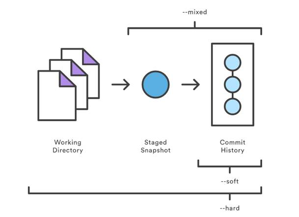
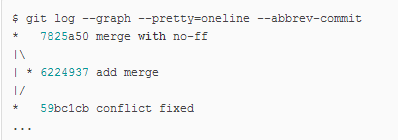
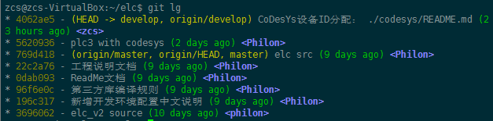
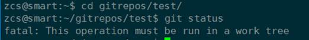
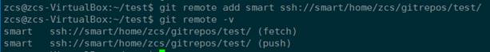
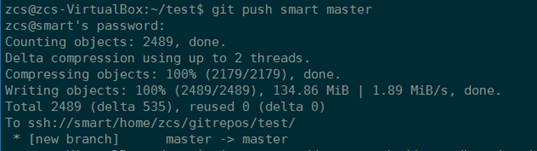
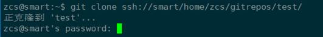
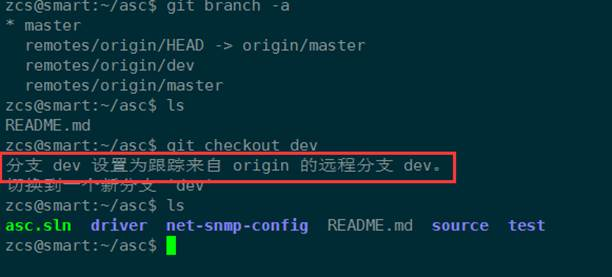
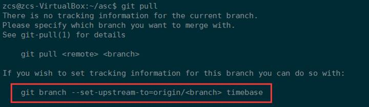
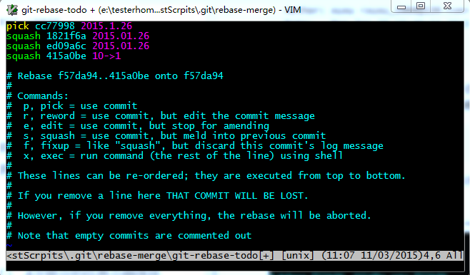

<!-- TOC -->

- [资源链接](#资源链接)
- [Git基础教程整理](#git基础教程整理)
  - [创建版本库](#创建版本库)
  - [版本回退](#版本回退)
  - [管理修改](#管理修改)
  - [远程仓库](#远程仓库)
  - [克隆远程仓库](#克隆远程仓库)
  - [创建与合并分支](#创建与合并分支)
  - [解决冲突](#解决冲突)
  - [分支策略](#分支策略)
  - [bug分支](#bug分支)
  - [多人协作](#多人协作)
  - [标签管理](#标签管理)
  - [配置别名](#配置别名)
- [远程仓库](#远程仓库-1)
  - [创建远程仓库](#创建远程仓库)
  - [关联远程仓库](#关联远程仓库)
  - [更改远程仓库关联URL](#更改远程仓库关联url)
- [远程分支](#远程分支)
  - [clone远程分支](#clone远程分支)
  - [删除远程分支](#删除远程分支)
  - [与本地分支的关联](#与本地分支的关联)
- [fetch 和 pull](#fetch-和-pull)
  - [区别](#区别)
  - [若你有多个 remote](#若你有多个-remote)
  - [是否有tracking](#是否有tracking)
  - [合并 origin/master 到 develop](#合并-originmaster-到-develop)
- [.gitignore](#gitignore)
- [修改提交历史](#修改提交历史)
  - [--amend](#--amend)
  - [rebase](#rebase)
  - [filter-branch](#filter-branch)
- [git references](#git-references)
- [稀疏检出和浅克隆](#稀疏检出和浅克隆)
- [large file storage](#large-file-storage)
- [commit规范](#commit规范)
  - [规范](#规范)
  - [工具Commitizen](#工具commitizen)
  - [工具Commitlint](#工具commitlint)
    - [一般使用](#一般使用)
    - [针对自定义Adapter](#针对自定义adapter)
    - [结合husky](#结合husky)
  - [生成changelog](#生成changelog)
- [github](#github)
  - [pull request流程](#pull-request流程)
  - [ssh key](#ssh-key)
  - [GitHub Pages](#github-pages)
  - [将项目web目录部署到gh-pages分支](#将项目web目录部署到gh-pages分支)
- [小技巧](#小技巧)
  - [保存密码](#保存密码)
  - [快捷命令设置](#快捷命令设置)
  - [配置用户名邮箱](#配置用户名邮箱)
  - [自动行尾](#自动行尾)
  - [提交空文件夹](#提交空文件夹)
- [代码统计](#代码统计)

<!-- /TOC -->

# 资源链接


权威文档  
<https://git-scm.com/docs>  


或者用 `--help` 查看帮助文档  

```
git --help
git clone --help
```


Git教程  @廖雪峰  
<http://www.liaoxuefeng.com/wiki/0013739516305929606dd18361248578c67b8067c8c017b000>  

另一份教程  @geeeeeeeeek  
<https://github.com/geeeeeeeeek/git-recipes/wiki>  


# Git基础教程整理


## 创建版本库

初始化一个Git仓库，使用`git init`命令。

添加文件到Git仓库，分两步：

-    第一步，使用命令`git add <file>`，注意，可反复多次使用，添加多个文件；

-    第二步，使用命令git commit，完成。

每次修改，如果不add到暂存区，那就不会加入到commit中。

 

-    要随时掌握工作区的状态，使用git status命令。

-    如果git status告诉你有文件被修改过，用git diff可以查看修改内容。

 

## 版本回退

-    HEAD指向的版本就是当前版本，因此，Git允许我们在版本的历史之间穿梭，使用命令`git reset --hard commit_id`。

-    穿梭前，用`git log`可以查看提交历史，以便确定要回退到哪个版本。

-    要重返未来，用`git reflog`查看命令历史，以便确定要回到未来的哪个版本。( 回到未来也是用`git reset`命令 )

 



图片来源:  
<https://github.com/geeeeeeeeek/git-recipes/wiki>  
5.2-代码回滚：Reset、Checkout、Revert的选择

 

## 管理修改

场景1：当你改乱了工作区某个文件的内容，想直接丢弃工作区的修改时，用命令`git checkout -- file`    (从stage里恢复到工作区,若stage空则从版本库恢复)

场景2：当你不但改乱了工作区某个文件的内容，还添加到了暂存区时，想丢弃修改，分两步，第一步用命令`git reset HEAD file`，就回到了场景1，第二步按场景1操作。

(或者`git checkout HEAD <file>`    直接从版本库 恢复到 stage和工作区)

场景3：已经提交了不合适的修改到版本库时，想要撤销本次提交，参考[版本回退](http://www.liaoxuefeng.com/wiki/0013739516305929606dd18361248578c67b8067c8c017b000/0013744142037508cf42e51debf49668810645e02887691000)一节，不过前提是没有推送到远程库。


 删除文件: 命令 `git rm` 用于确实地从版本库中删除一个文件


如果工作区中误删了文件可以从版本库中恢复：
```bash
git checkout --test.txt
```

 


## 远程仓库

要关联一个远程库，使用命令`git remote add origin git@server-name:path/repo-name.git`

（ 添加后，远程库的名字就是origin）

关联后，使用命令`git push -u origin master`第一次推送master分支的所有内容；

 

此后，每次本地提交后，只要有必要，就可以使用命令`git push origin master`推送最新修改；


## 克隆远程仓库

要克隆一个仓库，首先必须知道仓库的地址，然后使用`git clone`命令克隆。

Git支持多种协议，包括https，但通过ssh支持的原生git协议速度最快。

 

## 创建与合并分支

- 查看分支：`git branch`

- 创建分支：`git branch <name>`

- 切换分支：`git checkout <name>`

- 创建+切换分支：`git checkout -b <name>`

- 合并某分支到当前分支：`git merge <name>`

​        直接merge是fast forward模式，看不到分支历史

​        加上--no-ff可以保留分支历史
```bash
git merge --no-ff -m "merge with no-ff" dev
```


​        分支历史形式如下：



 

- 删除分支：`git branch -d <name>`

​        用 -d 只能删除被合并过的分支，删除还没合并的分支会报错 

​        如果要丢弃一个没有被合并过的分支，可以通过`git branch -D <name>`强行删除。

 

## 解决冲突

当Git无法自动合并分支时，就必须首先解决冲突。解决冲突后，再提交，合并完成。

用`git log --graph`命令可以看到分支合并图。


## 分支策略

在实际开发中，我们应该按照几个基本原则进行分支管理：

首先，master分支应该是非常稳定的，也就是仅用来发布新版本，平时不能在上面干活；

那在哪干活呢？干活都在dev分支上，也就是说，dev分支是不稳定的，到某个时候，比如1.0版本发布时，再把dev分支合并到master上，在master分支发布1.0版本；

你和你的小伙伴们每个人都在dev分支上干活，每个人都有自己的分支，时不时地往dev分支上合并就可以了。

所以，团队合作的分支看起来就像这样：

 


## bug分支

`git stash `      保存当前工作现场

​      stash保存当前工作后可新建分支来修复bug，修复完成后merge掉bug分支，继续之前的工作

`git stash list`     查看stash状态

`git stash apply`   恢复现场，但是stash内容不删除

`git stash drop`   删除stash内容

`git stash pop`    恢复现场，并且删除stash


## 多人协作

从远程库clone时，默认情况下，在本地只能看到本地的master分支

要在dev分支上开发，就必须创建远程origin的dev分支到本地

本地和远程分支的名称最好一致
```bash
git checkout -b dev origin/dev
```

在dev分支上开发，并不时push到远程
```bash
git push origin dev
```

push时有可能会与别人push的内容冲突，这时需要pull获取远程的最新提交 ，然后处理冲突
```bash
git pull
```

若 `git pull`失败，提示没有指定本地dev分支与远程origin/dev分支的链接，设置连接：
```bash
git branch --set-upstream dev origin/dev
```

查看远程库信息，使用 `git remote -v`


## 标签管理

-    命令`git tag <name>`用于新建一个标签，默认为HEAD，也可以指定一个commit id；

-    `git tag -a <tagname> -m "blablabla..."`可以指定标签信息；

-    `git tag -s <tagname> -m "blablabla..."`可以用PGP签名标签；

-    命令`git tag`可以查看所有标签。

-    `git tag -d <name>` 删除标签 

-    `git push origin <tagname>` 推送某个标签到远程

-    `git push origin --tags`   全部尚未推送到远程的本地标签

删除远程标签： 先删除本地标签，然后 `git push origin :refs/tags/<tagname>` 


## 配置别名

例：  
```bash
git config --global alias.lg "log --color --graph --pretty=format:'%Cred%h%Creset -%C(yellow)%d%Creset %s %Cgreen(%cr) %C(bold blue)<%an>%Creset' --abbrev-commit"
```

`--global` 表示针对当前用户起作用的，如果不加，只针对当前的仓库起作用  

然后可以直接 `git lg`  




# 远程仓库

## 创建远程仓库

```
mkdir -p gitrepos/test/
cd gitrepos/test/
git init --bare
```

远程仓库创建成功:


 

或者将一个现有仓库变更为远程仓库:

```
git config --bool core.bare true
```


作为远程仓库的目录下, 不能进行`git add`等操作, 会提示如下错误: 

> fatal: This operation must be run in a work tree



 

## 关联远程仓库

将某个已有目录初始化为git仓库, 并关联远程仓库:

```
cd <path>
git init
git remote add <远程仓库名> ssh://<IP>/<path>/
git remote -v               //查看关联上的远程仓库
```

 

远程仓库名可以随便取, 一般用origin



然后就可以push和pull等操作了

```
git add .
git commit -m "xxx"
git push <远程仓库名> <分支名>
```



 

或者, clone该远程仓库:



需要输入用户密码.

可以使用 `git config --global credential.helper store` 记住密码  


## 更改远程仓库关联URL

<https://help.github.com/articles/changing-a-remote-s-url/>


```
git remote set-url origin https://github.com/<USERNAME>/<REPOSITORY>.git
```


或者
```
git remote set-url origin git@github.com:<USERNAME>/<REPOSITORY>.git
```


# 远程分支

## clone远程分支

`git clone`默认会把远程仓库整个给clone下来

但只会在本地默认创建一个master分支

如果远程还有其他的分支，此时用`git branch -a`查看所有分支

`git checkout <branch-name>`  
本地库已经有这个分支则切换到这个分支, 本地库没有而远程分支里有的话, 会创建一个本地与其关联的分支并切换过去  

  

其他: `git ckeckout --track remotes/orgin/<branch>`等用法,   
参考链接: <https://git-scm.com/docs/git-checkout>  
或者使用命令`git checkout --help`查看帮助文档  


## 删除远程分支

http://www.cnblogs.com/wangkongming/p/4164516.html

```
git push origin (空格):<要删除的远程分支>
```


## 与本地分支的关联

查看关联：

```
git branch -vv
```

或者可通过查看仓库.git目录下的config文件来知道关联情况

  

建立关联：

http://blog.csdn.net/netwalk/article/details/21088405

```
git branch --set-upstream debug origin/debug 
```



若无关联，push会在远程新建同名分支，pull会出现以上提示

```
git branch --set-upstream-to=origin/<branch> <local_branch>
git checkout --track origin/serverfix
```

The --set-upstream flag is deprecated and will be removed. Consider using --track or --set-upstream-to


# fetch 和 pull

https://ruby-china.org/topics/15729

 

## 区别

`git fetch` 拿到了远程所有分支的更新，用 `cat .git/FETCH_HEAD` 可以看到其状态

`git pull` = `git fetch + merge`, 若`git fetch`后FETCH_HEAD 都是 not-for-merge 则不会有接下来的 merge 动作

merge 动作的默认目标是当前分支，若要切换目标，可以直接切换分支

merge 动作的来源则取决于你是否有 tracking，若有则读取配置自动完成，若无则请指明【来源】

```bash
# 当你在 master 下
git pull
# 等于 fetch origin，然后 merge origin/master

# 当你在 develop 下
git pull
# 等于 fetch origin，然后 merge origin/develop
```


## 若你有多个 remote

`git pull [remote name]` 所做的事情是：

fetch [remote name] 的所有分支

寻找本地分支有没有 tracking 这些分支的，若有则 merge 这些分支，若没有则 merge 当前分支

另外，若只有一个 remote，假设叫 origin，那么 `git pull` 等价于 `git pull origin`  

平时养成好习惯，没谱的时候都把 【来源】带上

 

## 是否有tracking

如果你曾经这么推过：`git push -u origin master`，那么你执行这条命令时所在的分支就已经 tracking to origin/master 了，-u 的用处就在这里

如果你记不清了：`cat .git/config`，给你一张截图，注意红色方框标示的地方（上半部分是 tracking 的，下半部分是 untracking 的），由此可见，tracking 的本质就是指明 pull 的 merge 动作来源


使用命令 `git branch -vv` 也可以查看分支关联  

 

## 合并 origin/master 到 develop 

```
# 当你在 master 下
git checkout develop # 切换到 develop，这就是 【目标】
git pull origin master  # 合并 origin/master，这就是 【来源】

```

 

# .gitignore

<https://git-scm.com/docs/gitignore>  
<https://www.barretlee.com/blog/2015/09/06/set-gitignore-after-add-file/>  

If the pattern does not contain a slash /, Git treats it as a shell glob pattern and checks for a match against the pathname relative to the location of the `.gitignore` file   
不加斜杠 `/` 的写法, 栗如 `foo` , 被视为"glob pattern", 对文件夹, 文件和链接都有效  
可以前加 `/` 表路径 `/foo`  


`foo/` will match a directory `foo` and paths underneath it, but will not match a regular file or a symbolic link `foo`  
加斜杠的写法 `foo/` 匹配所有 `foo` 文件夹及文件夹下的内容(递归, 包括子路径里的) , 不匹配文件和符号链接  


假设目录结构: /aaa/bbb/ccc/xxx.xx  
写法 `ccc` 或 `ccc/` 都可以成功ignore 这里的 ccc 目录  
但是写法 `bbb/ccc` 不能, 这种需要写成 `**/bbb/ccc`  


glob 匹配规则:  
"`*`" matches anything except "`/`",  
"`?`" matches any one character except "`/`"  
"`[]`" matches one character in a selected range.  
`**`  如果一个 pattern 以 `**` 开头，如 `**/foo`，最后会匹配所有文件夹下的 foo 文件(夹)  
如果一个 pattern 以 `/**` 开头，如 `abc/**`，则表示匹配 abc 目录下的所有内容  
如果一个 pattern 中间包含 `**`，如 `a/**/b`，则会匹配 `a/b`、`a/x/b`、`a/x/y/b`以及所有类似的内容  


An optional prefix "`!`" which negates the pattern; any matching file excluded by a previous pattern will become included again.  
It is not possible to re-include a file if a parent directory of that file is excluded.  
用 `!` 可以取消ignore, 但如果父文件夹已经被ignore了的话, `!` 也救不回其下面的文件  
可以用如下栗子的方式, ignore `/log/**` , 不要直接ignore `log/`  

```
# 栗子, ignore log下的任何东西但是保留log文件夹本身
/log/**
!/log/.gitkeep
```


Example to exclude everything except a specific directory `foo/bar` (note the `/*` - without the slash, the wildcard would also exclude everything within `foo/bar`):  

```
$ cat .gitignore
# exclude everything except directory foo/bar
/*
!/foo
/foo/*
!/foo/bar
```

 

# 修改提交历史

参考:  
[Git 工具 - 重写历史  @git-scm.com](https://git-scm.com/book/zh/v1/Git-%E5%B7%A5%E5%85%B7-%E9%87%8D%E5%86%99%E5%8E%86%E5%8F%B2)  
[代码合并：Merge、Rebase-的选择  @geeeeeeeeek](https://github.com/geeeeeeeeek/git-recipes/wiki/5.1-%E4%BB%A3%E7%A0%81%E5%90%88%E5%B9%B6%EF%BC%9AMerge%E3%80%81Rebase-%E7%9A%84%E9%80%89%E6%8B%A9)  
[Rebase 代替合并  @git-tower.com](https://www.git-tower.com/learn/git/ebook/cn/command-line/advanced-topics/rebase)  


## --amend

修改最近一次提交的用户名  

```
git commit --amend --author="NewAuthor <NewEmail@address.com>"
```

<http://i.dotidea.cn/2015/04/git-amend-author/>  


## rebase

可以整理提交历史

```
git checkout feature
git rebase -i master       # -i 表示交互式rebase; 可以不加i
```

此操作重写了feature的提交历史, 把master的提交并入到了feature分支的提交历史中  
**注意不要在公共分支rebase**  


rebase可以用于:  将自己的feather分支并入公共分支前, 整理去掉杂乱的提交历史

利用rebase来压缩多次提交

```
git rebase -i HEAD~4
```

最后一个数字4代表压缩最后四次提交
 

```
git rebase -i commitID
```

整理该commit与其之后的提交.

 

## filter-branch

<https://git-scm.com/docs/git-filter-branch>  

 

**从所有提交中删除一个文件**

```
$ git filter-branch --tree-filter 'rm -f passwords.txt' HEAD
Rewrite 6b9b3cf04e7c5686a9cb838c3f36a8cb6a0fc2bd (21/21)
Ref 'refs/heads/master' was rewritten
```

 

**全局更换邮件地址**

```
git filter-branch --commit-filter '
        if [ "$GIT_COMMITTER_EMAIL" = "foo@bar.com" ];
        then
                GIT_AUTHOR_NAME="kami";
                GIT_AUTHOR_EMAIL=" ";
                GIT_COMMITTER_NAME="kami";
                GIT_COMMITTER_EMAIL=" ";
                git commit-tree "$@";
        else
                git commit-tree "$@";
        fi' HEAD
```

匹配条件及修改值根据情况修改  
参考: [Git Internals - Environment Variables](https://git-scm.com/book/en/v2/Git-Internals-Environment-Variables)  


**可能出现的异常**

Cannot create a new backup.  
A previous backup already exists in refs/original/  
Force overwriting the backup with -f  

解决: 
```
git update-ref -d refs/original/refs/heads/master
```

参考: <https://stackoverflow.com/questions/7654822/remove-refs-original-heads-master-from-git-repo-after-filter-branch-tree-filte>  


# git references

[Git-内部原理-Git-References  @git-scm.com](https://git-scm.com/book/zh/v1/Git-%E5%86%85%E9%83%A8%E5%8E%9F%E7%90%86-Git-References)  


# 稀疏检出和浅克隆

<https://www.worldhello.net/gotgit/08-git-misc/090-sparse-checkout-and-shallow-clone.html>  
<https://git-scm.com/docs/git-read-tree>  

 

稀疏检出:  
本地还是有完整版本库, 根据.git/info/sparse-checkout文件的配置决定只关注哪些文件  
语法类型同 `.gitnore` 文件  


浅克隆  
执行 `git clone` 或者 `git fetch` 操作时用 `--depth <depth>` 参数设定要获取的历史提交的深度（ `<depth>` 大于0），就会把源版本库分支上最近的 `<depth> + 1` 个历史提交作为新版本库的全部历史提交.  
浅克隆一般用于对远程版本库的查看和研究，如果在浅克隆版本库中进行了提交，最好通过 `git format-patch` 命令导出为补丁文件再应用到远程版本库中  


浅克隆的一个限制是，你不能从它推送到一个新的存储库  
> ! [remote rejected] master -> master (shallow update not allowed)
```
git fetch --unshallow old-remote
```
然后再重新 push 到 new-remote
<https://codeday.me/bug/20170703/33672.html>  


# large file storage

Git LFS 操作指南 <https://zzz.buzz/zh/2016/04/19/the-guide-to-git-lfs/>  

安装 <https://git-lfs.github.com/>  

Git LFS 被主流的 Git 服务如 [GitHub](https://github.com/) 和 [GitLab](https://about.gitlab.com/) 支持  

使用 Git LFS，在默认情况下，只有当前签出的 commit 下的 LFS 对象的当前版本会被下载  

 

通过 Git LFS 所管理的对象实际在本地的存储位置是在 .git/lfs/objects 目录下，该目录根据对象的 sha256 值来组织。

作为对比，Git 自身所管理的对象则是存储在 .git/objects 目录下，根据 commit, tree, blob, tag 的 sha1 值来组织。

Git LFS 对象在服务器上可以存储在 Git 仓库之外的任何地方，具体位置由 Git LFS Server 的配置决定，而与 Git 客户端无关。


```
# 查看当前使用 Git LFS 管理的匹配列表
git lfs track

# 使用 Git LFS 管理指定的文件
git lfs track "*.psd"

# 不再使用 Git LFS 管理指定的文件
git lfs untrack "*.psd"

# 类似 `git status`，查看当前 Git LFS 对象的状态
git lfs status

# 枚举目前所有被 Git LFS 管理的具体文件
git lfs ls-files

# 检查当前所用 Git LFS 的版本
git lfs version

# 针对使用了 LFS 的仓库进行了特别优化的 clone 命令，显著提升获取
# LFS 对象的速度，接受和 `git clone` 一样的参数。 [1] [2]
# 自 Git LFS 2.3.0 版本起，git lfs clone 已不再推荐使用, 最新版本的 git clone 已经能够提供与 git lfs clone 一致的性能
git lfs clone https://github.com/user/repo.git

# 获取当前 commit 下包含的 LFS 对象的当前版本
git lfs fetch
git lfs checkout
# 或
git lfs pull

# 操作定制文件夹
git config lfs.fetchinclude 'images/**'
git config lfs.fetchexclude 'videos/**'
git config lfs.fetchinclude 'videos/**'
git config lfs.fetchexclude 'videos/chameleon.mp4'
```


# commit规范

<http://www.ruanyifeng.com/blog/2016/01/commit_message_change_log.html>  

优雅的提交你的 Git Commit Message <https://juejin.im/post/5afc5242f265da0b7f44bee4>  

## 规范

```
<type>(<scope>): <subject>
// 空一行
<body>
// 空一行
<footer>
```

**Header** 是必需的, **Body** 和 **Footer** 可以省略  
**type** 用于说明 commit 的类别，只允许使用下面7个标识  

- feat：新功能（feature）
- fix：修补bug
- docs：文档（documentation）
- style： 格式（不影响代码运行的变动）
- refactor：重构（即不是新增功能，也不是修改bug的代码变动）
- test：增加测试
- chore：构建过程或辅助工具的变动

**scope** 用于说明 commit 影响的范围，比如数据层、控制层、视图层等等，视项目不同而不同

**subject** 是 commit 目的的简短描述，不超过50个字符

**Body** 部分是对本次 commit 的详细描述，可以分成多行

**Footer** 部分只用于两种情况

（1）不兼容变动

（2）关闭 Issue

 

还有一种特殊情况，如果当前 commit 用于撤销以前的 commit，则必须以 `revert:` 开头，后面跟着被撤销 Commit 的 Header

详见<http://www.ruanyifeng.com/blog/2016/01/commit_message_change_log.html>  

 

## 工具Commitizen

<https://github.com/commitizen/cz-cli>  

 

**全局安装**

Install commitizen globally, if you have not already.
```
npm install -g commitizen
```

Install your preferred commitizen adapter globally, for example [cz-conventional-changelog](https://www.npmjs.com/package/cz-conventional-changelog)
```
npm install -g cz-conventional-changelog
```

Create a .czrc file in your home directory, with path referring to the preferred, globally installed, commitizen adapter
```
echo '{ "path": "cz-conventional-changelog" }' > ~/.czrc
```

You are all set! Now cdinto any git repository and use git cz instead of git commit and you will find the commitizenprompt.

<https://github.com/commitizen/cz-cli>  

 

**本地安装**

```
npm install -g commitizen
```

在项目目录里，运行下面的命令，使其支持 Angular 的 Commit message 格式。
```
commitizen init cz-conventional-changelog --save --save-exact
```

以后，凡是用到 `git commit` 命令，一律改为使用 `git cz`  

 

也许 Angular 的那套规范我们不习惯, 那么可以通过指定 Adapter [cz-customizable](https://link.juejin.im/?target=https%3A%2F%2Flink.zhihu.com%2F%3Ftarget%3Dhttps%3A%2F%2Fgithub.com%2Fleonardoanalista%2Fcz-customizable) 指定一套符合自己团队的规范

全局 或 项目级别安装:

```
npm i -g cz-customizable
# or
npm i -D cz-customizable
```

修改 .czrc 或 package.json 中的 config 为:

```
{ "path": "cz-customizable" }
```

or

```
  "config": {
    "commitizen": {
      "path": "node_modules/cz-customizable"
    }
  }
```

同时在 `~/` 或项目目录下创建 `.cz-config.js` 文件, 维护你想要的格式:  
比如一个配置文件: [leohxj/.cz-config](https://link.juejin.im?target=https%3A%2F%2Flink.zhihu.com%2F%3Ftarget%3Dhttps%3A%2F%2Fgist.github.com%2Fleohxj%2F7bc928f60bfa46a3856ddf7c0f91ab98)

<https://juejin.im/post/5afc5242f265da0b7f44bee4>  

 

## 工具Commitlint

参考 <https://juejin.im/post/5afc5242f265da0b7f44bee4>  

 

### 一般使用

[commitlint](https://link.juejin.im/?target=https%3A%2F%2Flink.zhihu.com%2F%3Ftarget%3Dhttps%3A%2F%2Fgithub.com%2Fmarionebl%2Fcommitlint): 可以帮助我们 lint commit messages, 如果我们提交的不符合指向的规范, 直接拒绝提交, 

同样的, 它也需要一份校验的配置, 这里推荐 [@commitlint/config-conventional](https://link.juejin.im/?target=https%3A%2F%2Flink.zhihu.com%2F%3Ftarget%3Dhttps%3A%2F%2Fgithub.com%2Fmarionebl%2Fcommitlint%2Ftree%2Fmaster%2F%40commitlint%2Fconfig-conventional) (符合 Angular团队规范).

```
npm i -D @commitlint/config-conventional @commitlint/cli
```

同时需要在项目目录下创建配置文件 `.commitlintrc.js`, 写入:

```
module.exports = {
  extends: [
    ''@commitlint/config-conventional''
  ],
  rules: {
  }
};
```

 

### 针对自定义Adapter

```
npm i -D commitlint-config-cz @commitlint/cli
```

```
module.exports = {
  extends: [
    'cz'
  ],
  rules: {
  }
};
```

 

### 结合husky

校验 commit message 的最佳方式是结合 git hook, 所以需要配合 [Husky](https://link.juejin.im?target=https%3A%2F%2Flink.zhihu.com%2F%3Ftarget%3Dhttps%3A%2F%2Fgithub.com%2Ftypicode%2Fhusky).

```
npm i husky@next
```

package.json 中添加:

```
"husky": {
    "hooks": {
      ...,
      "commit-msg": "commitlint -e $GIT_PARAMS"
    }
  },
```

##   生成changelog

如果你的所有 Commit 都符合 Angular 格式，那么发布新版本时， Change log 就可以用脚本自动生成

```
$ npm install -g conventional-changelog
$ cd my-project
$ conventional-changelog -p angular -i CHANGELOG.md -w
```

<http://www.ruanyifeng.com/blog/2016/01/commit_message_change_log.html>  

 

借助 [standard-version](https://link.juejin.im/?target=https%3A%2F%2Flink.zhihu.com%2F%3Ftarget%3Dhttps%3A%2F%2Fgithub.com%2Fconventional-changelog%2Fstandard-version) 这样的工具, 自动生成 CHANGELOG, 甚至是 语义化的版本号([Semantic Version](https://link.juejin.im/?target=https%3A%2F%2Flink.zhihu.com%2F%3Ftarget%3Dhttp%3A%2F%2Fsemver.org%2Flang%2Fzh-CN%2F)).

<https://juejin.im/post/5afc5242f265da0b7f44bee4>  

 


# github

## pull request流程

1. 从他人页面fork
2. 从fork到的在自己名下的库 clone 到本地
3. 本地修改完后commit、push到自己的远程库
4. 在他人页面点pull request

 

同步原库 : fork之后, 在自己fork的库下关联原库, 然后fetch

```
git remote addupstream https:\\xxxxx.git 
git fetch upstream
```


## ssh key

<https://segmentfault.com/q/1010000003061640>  

**生成key:**  

```
git config --global user.name "yourname"
git config --global user.email "youremail"
ssh-keygen -t rsa -C “youremail
```

**在github添加公钥:**  
<https://github.com/settings/ssh/new>  

**本地添加私钥:**  

```
chmod 0600 id_rsa
eval `ssh-agent -s`
ssh-add id_rsa
```


**测试是否成功:**  
```
ssh git@github.com
```


**可能的问题及解决**  

> permission for id_rsa is too open

<https://cnbin.github.io/blog/2015/06/18/permission-0644-for-slash-root-slash-dot-ssh-slash-id-rsa-are-too-open-jie-jue-ban-fa/>  

 

> Could not open a connection to your authentication agent

<https://stackoverflow.com/questions/17846529/could-not-open-a-connection-to-your-authentication-agent>  

 

 

## GitHub Pages

<https://help.github.com/categories/github-pages-basics/>  

 

## 将项目web目录部署到gh-pages分支

`git subtree` 是一条git子命令，可以在多个git项目之间双向同步子项目，简单的说就是：可以在一个项目中引用另外一个项目仓库中的代码


1. 切换到gh-pages分支 

```
git checkout -b gh-pages    # 创建gh-pages并切换到该分支
git checkout gh-pages    # 切换到gh-pages分支
```

2. 构建代码 

3. 将build/dist目录下的所有文件夹推送至远程仓库的gh-pages分支，

```
# 强制添加build(react项目)/dist/_book(gitbook项目)文件夹，因为.gitignore文件中定义了忽略该文件 
git add -f dist 
# 提交到本地暂存区 
git commit -m 'update'  
# 部署dist目录下的代码 
git subtree push --prefix dist origin gh-pages
```


# 小技巧

## 保存密码

<http://www.cnblogs.com/wish123/p/3937851.html>  

保存密码，避免每次push、pull都要输密码  
```
git config --global credential.helper store
```


**windows中修改保存的信息**

1. 进入控制面板  
1. 选择用户账户  
1. 选择管理你的凭据  
1. 选择Windows凭据  
1. 选择git保存的用户信息  
1. 选择编辑或者进行删除操作  

 

## 快捷命令设置

```
git config --global alias.ck "checkout"
git config --global alias.st "status"
git config --global alias.lg "log --color --graph --pretty=format:'%Cred%h%Creset -%C(yellow)%d%Creset %s %Cgreen(%cr) %C(bold blue)<%an>%Creset' --abbrev-commit"
```


## 配置用户名邮箱

**查看**
```
git config user.name
git config user.email
```


**设置**
```
// 设置全局
git config --global user.name "Author Name"
git config --global user.email "Author Email"

// 或者设置本地项目库配置
git config user.name "Author Name"
git config user.email "Author Email"
```


## 自动行尾

[https://git-scm.com/book/zh/v2/自定义-Git-配置-Git](https://git-scm.com/book/zh/v2/%E8%87%AA%E5%AE%9A%E4%B9%89-Git-%E9%85%8D%E7%BD%AE-Git)  

```
git config --global core.autocrlf input
```

- true:             x -> LF -> CRLF
- input:            x -> LF -> x
- false:            x -> x -> x  

where x is either CRLF (windows-style) or LF (unix-style) and arrows stand for  
file to commit -> repository -> checked out file  

 

## 提交空文件夹

在空文件夹中放一个 `.gitkeep` 文件  
.gitignore中加上: `!.gitkeep`  
详见[.gitignore](#.gitignore)  

 

# 代码统计

**个人代码量**
```
git log --author="username" --pretty=tformat: --numstat | awk '{ add += $1; subs += $2; loc += $1 - $2 } END { printf "added lines: %s, removed lines: %s, total lines: %s\n", add, subs, loc }' -
```

**每个人代码量**
```
git log --format='%aN' | sort -u | while read name; do echo -en "$name\t"; git log --author="$name" --pretty=tformat: --numstat | awk '{ add += $1; subs += $2; loc += $1 - $2 } END { printf "added lines: %s, removed lines: %s, total lines: %s\n", add, subs, loc }' -; done
```


**仓库提交者排名前5**
```
git log --pretty='%aN' | sort | uniq -c | sort -k1 -n -r | head -n 5
```


**贡献者统计**
```
git log --pretty='%aN' | sort -u | wc -l
```


**提交数统计**
```
git log --oneline | wc -l 
```
