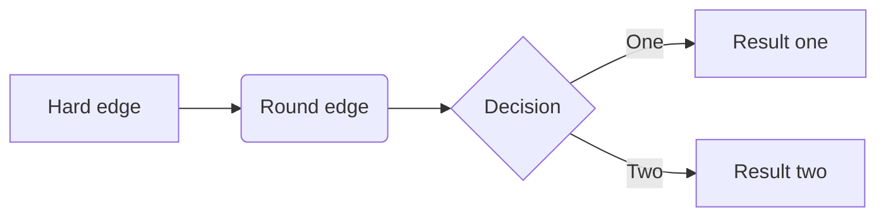

<!-- TOC -->

- [语法](#语法)
  - [标题](#标题)
  - [段落](#段落)
  - [字体](#字体)
  - [分隔线](#分隔线)
  - [删除线](#删除线)
  - [下划线](#下划线)
  - [脚注](#脚注)
  - [列表](#列表)
  - [区块](#区块)
  - [代码](#代码)
  - [链接](#链接)
  - [图片](#图片)
  - [表格](#表格)
  - [HTML元素](#html元素)
  - [转义](#转义)
  - [公式](#公式)
  - [符号表情](#符号表情)
  - [TOC](#toc)
  - [任务列表](#任务列表)
  - [锚点](#锚点)
  - [文件跳转](#文件跳转)
  - [导图](#导图)
    - [sequence](#sequence)
    - [flow](#flow)
    - [flowchart](#flowchart)
  - [目录树](#目录树)
  - [自定义折叠区](#自定义折叠区)
- [Github Flavord](#github-flavord)
- [推荐编辑器](#推荐编辑器)
- [参考链接](#参考链接)

<!-- /TOC -->

# 语法

## 标题

```
# 一级标题
## 二级标题
### 三级标题
#### 四级标题
##### 五级标题
###### 六级标题
```


## 段落

段落的换行是使用两个以上空格加上回车。


## 字体

Markdown 可以使用以下几种字体：

```
*斜体文本*
**粗体文本**
***粗斜体文本***
_斜体文本_
__粗体文本__
___粗斜体文本___
```


## 分隔线

你可以在一行中用三个以上的星号、减号、底线来建立一个分隔线，行内不能有其他东西。你也可以在星号或是减号中间插入空格。下面每种写法都可以建立分隔线：

```
***
* * *
*****
- - -
----------
```


## 删除线

如果段落上的文字要添加删除线，只需要在文字的两端加上两个波浪线 **~~** 即可，实例如下：

```
RUNOOB.COM
GOOGLE.COM
~~BAIDU.COM~~
```


## 下划线

下划线可以通过 HTML 的` <u>` 标签来实现：


## 脚注

脚注是对文本的补充说明。

Markdown 脚注的格式如下:

```bash
[^要注明的文本]
```

以下实例演示了脚注的用法：

```bash
正文[^1]文字
[^1]: 脚注内容
```

正文[^1]文字

[^1]: 脚注内容


## 列表

无序列表使用星号(*)、加号(+)或是减号(-)作为列表标记：

```
- 第一项
- 第二项
- 第三项

* 第一项
* 第二项
* 第三项

+ 第一项
+ 第二项
+ 第三项
```


有序列表使用数字并加上 **.** 号来表示，如：

```bash
1. 第一项
2. 第二项
3. 第三项

1. 第一项
1. 第二项
1. 第三项
```

渲染引擎会自动递增前面的序号


## 区块

区块可嵌套

```
> 最外层
> > 第一层嵌套
> > > 第二层嵌套
```

区块中使用列表

```
> 1. 第一项
> 2. 第二项
> - 第一项
> - 第二项
> - 第三项
```

> 1. 第一项
> 2. 第二项
> - 第一项
> - 第二项
> - 第三项


列表中使用区块

```
- 第一项
    > 菜鸟教程  
    > 学的不仅是技术更是梦想  
- 第二项
```

- 第一项
    > 菜鸟教程
    > 学的不仅是技术更是梦想
- 第二项

## 代码

如果是段落上的一个函数或片段的代码可以用反引号 ` 把它包起来

```
`printf()` 函数
```

可以用 ``` 或 ~~~ 包裹一段代码，并指定一种语言（也可以不指定）：

~~~
​```javascript
$(document).ready(function () {
    alert('RUNOOB');
});
​```
~~~

或者: 行首使用 **4 个空格**或一个**制表符（Tab 键）** 表示代码区块  
<https://github.github.com/gfm/#indented-code-blocks>  


## 链接

```
[链接名称](链接地址)
```

```
<链接地址>
```

```
链接也可以用变量来代替，文档末尾附带变量地址：
这个链接用 1 作为网址变量 [Google][1]
这个链接用 runoob 作为网址变量 [Runoob][runoob]
然后在文档的结尾为变量赋值（网址）

  [1]: http://www.google.com/
  [runoob]: http://www.runoob.com/
```


## 图片

```

```

```

```

```
这个链接用 1 作为网址变量 [RUNOOB][1].
然后在文档的结尾位变量赋值（网址）

[1]: http://static.runoob.com/images/runoob-logo.png
```


Markdown 还没有办法指定图片的高度与宽度，如果你需要的话，你可以使用普通的 `` 标签。

```

```


## 表格

```
|  表头   | 表头  |
|  ----  | ----  |
| 单元格  | 单元格 |
| 单元格  | 单元格 |

```

```
| 左对齐 | 右对齐 | 居中对齐 |
| :-----| ----: | :----: |
| 单元格 | 单元格 | 单元格 |
| 单元格 | 单元格 | 单元格 |

```


## HTML元素

目前支持的 HTML 元素有：`<kdb> <b> <i> <em> <sup> <sub> <br>`等


## 转义

Markdown 支持以下这些符号前面加上反斜杠来帮助插入普通的符号

```
\   反斜线
`   反引号
*   星号
_   下划线
{}  花括号
[]  方括号
()  小括号
#   井字号
+   加号
-   减号
.   英文句点
!   感叹号

```


## 公式

使用两个美元符 $$ 包裹 TeX 或 LaTeX 格式的数学公式来实现

```
$$
\mathbf{V}_1 \times \mathbf{V}_2 =  \begin{vmatrix} 
\mathbf{i} & \mathbf{j} & \mathbf{k} \\
\frac{\partial X}{\partial u} &  \frac{\partial Y}{\partial u} & 0 \\
\frac{\partial X}{\partial v} &  \frac{\partial Y}{\partial v} & 0 \\
\end{vmatrix}
$$
```

$$
\mathbf{V}_1 \times \mathbf{V}_2 =  \begin{vmatrix} 
\mathbf{i} & \mathbf{j} & \mathbf{k} \\
\frac{\partial X}{\partial u} &  \frac{\partial Y}{\partial u} & 0 \\
\frac{\partial X}{\partial v} &  \frac{\partial Y}{\partial v} & 0 \\
\end{vmatrix}
$$

注意: GitHub Flavored Markdown不支持LaTex  
但是可以用别的方法实现:

```
})
```

})  
参考: <https://www.zhihu.com/question/26887527>  

另: 一个在线公式编辑器 <http://latex.codecogs.com/>  


**LaTeX参考:**

Cmd Markdown 公式指导手册   (LaTex快速入门)  
<https://www.zybuluo.com/codeep/note/163962>  


LaTeX Documentation  (官方文档)
<https://www.latex-project.org/help/documentation/#general-documentation>  
<https://www.latex-project.org/help/documentation/usrguide.pdf>  


**相关扩展:**

MathML 是 W3C 于 1998 年 4 月 7 日提出的一个推荐标准，主要用于解决数学专业中符号以及表达式的存储、显示、交换和管理等问题，现在已逐渐成为 Web 数学出版事实上的标准。

LaTeX 是由 Leslie Lamport 在八十年代早期基于 Donald E. Knuth 教授的 TeX 系统开发的一种宏语言，它使得 TeX 系统更易于使用。LaTeX 适合排版普通文章、书籍、报告、书信及幻灯片等，应用领域可以说是 TeX 和 MathML 的超集。虽说 LaTeX 是一种通用语言，但其数学排版功能也非常强，有许多数学相关的文档是以 LaTeX 格式编排的。

MathML 与 LaTeX 的映射关系分析
<https://www.ibm.com/developerworks/cn/xml/x-mathml2/index.html>  


[MathJax](https://www.mathjax.org/)是一款运行在浏览器中的开源数学符号渲染引擎，使用MathJax可以方便的在浏览器中显示数学公式，不需要使用图片。目前，MathJax可以解析Latex、MathML和ASCIIMathML的标记语言。  
<https://www.mathjax.org/>  
<https://docs.mathjax.org/en/latest/index.html>  


## 符号表情

```
:happy:
```

:happy::blush:

具体每一个表情的符号码，可以查询GitHub的官方网页<http://www.emoji-cheat-sheet.com>  
或者 <https://github.com/guodongxiaren/README/blob/master/emoji.md>


TODO : 支持情况


## TOC

```
[TOC]
```

Typora中有效  
Github / Github Pages中无效  
vscode有插件[Markdown TOC]( https://marketplace.visualstudio.com/items?itemName=AlanWalk.markdown-toc )可以生成TOC  


## 任务列表

```
- [x] 吃饭
- [ ] 睡觉
```

- [x] 吃饭
- [ ] 睡觉


## 锚点

每一个标题都是一个锚点

```
[回到顶部](#语法)
```

[回到顶部](#语法)


或者使用`<a>`标签

```html
<a id="bottom"></a>

<a href="#bottom">跳转到底部</a>
[跳转到底部](#bottom)
```

<a href="#bottom">跳转到底部</a>


## 文件跳转

```
[上层README.md](../README.md)
```

[上层README.md](../README.md)


## 导图

<https://support.typora.io/Draw-Diagrams-With-Markdown/>

### sequence

    ​```sequence
    Alice->Bob: Hello Bob, how are you?
    Note right of Bob: Bob thinks
    Bob-->Alice: I am good thanks!
    ```


### flow

~~~
```flow
st=>start: Start
op=>operation: Your Operation
cond=>condition: Yes or No?
e=>end

st->op->cond
cond(yes)->e
cond(no)->op
```
~~~

### flowchart

~~~

~~~


更多见[文档](<https://support.typora.io/Draw-Diagrams-With-Markdown/>)..  

注意: GitHub Flavored Markdown不支持  


## 目录树

```
tree --dirsfirst --charset=ascii /path/to/directory
```

或

```
npm install mddir -g
node mddir "../relative/path/"
```

参考

<https://vimsky.com/article/3606.html>  
<http://landcareweb.com/questions/2298/zai-markdownyu-fa-zhong-biao-shi-mu-lu-he-wen-jian-jie-gou>  


## 自定义折叠区


<https://developer.mozilla.org/en-US/docs/Web/HTML/Element/details>  

```
<details>
    <summary>Details</summary>
	Something small enough to escape casual notice.
</details>
```

<details>
    <summary>Details</summary>
    Something small enough to escape casual notice.
</details>

<https://www.w3cschool.cn/lme/93u61srz.html>  

```
region i { information 示例
← information icon
} region information 示例
```

这种试了无效..


# Github Flavord

<https://help.github.com/en/articles/autolinked-references-and-urls>  
<https://github.github.com/gfm/>  


| Reference type                                               | Raw reference                                    | Short link                                                   |
| ------------------------------------------------------------ | ------------------------------------------------ | ------------------------------------------------------------ |
| Issue or pull request URL                                    | <https://github.com/jlord/sheetsee.js/issues/26> | [#26](https://github.com/jlord/sheetsee.js/issues/26)        |
| `#` and issue or pull request number                         | #26                                              | [#26](https://github.com/jlord/sheetsee.js/issues/26)        |
| `GH-` and issue or pull request number                       | GH-26                                            | [GH-26](https://github.com/jlord/sheetsee.js/issues/26)      |
| `Username/Repository#` and issue or pull request number      | jlord/sheetsee.js#26                             | [jlord/sheetsee.js#26](https://github.com/jlord/sheetsee.js/issues/26) |
| `Organization_name/Repository#` and issue or pull request number | github/linguist#4039                             | [github/linguist#4039](https://github.com/github/linguist/pull/4039) |


# 推荐编辑器

- [typora]( https://www.typora.io/ )
- vscode + [ Markdown All in One ]( https://marketplace.visualstudio.com/items?itemName=yzhang.markdown-all-in-one )


# 参考链接 

语法  
<https://guides.github.com/features/mastering-markdown/>  
<https://segmentfault.com/markdown>  
<http://wowubuntu.com/markdown/>  
 <http://www.runoob.com/markdown/md-advance.html>  
<https://www.w3cschool.cn/lme/>  


README文件语法解读，即Github Flavored Markdown语法介绍  
<https://github.com/guodongxiaren/README>  
<https://help.github.com/en/categories/writing-on-github>  


writage: Markdown plugin for Microsoft Word  
<http://www.writage.com/>  

 

`Editor.md` ---- 开源在线 Markdown 编辑器  
<https://pandao.github.io/editor.md/index.html>  


vscode中markdown支持  
<https://code.visualstudio.com/docs/languages/markdown>  

<a id="bottom"></a>


