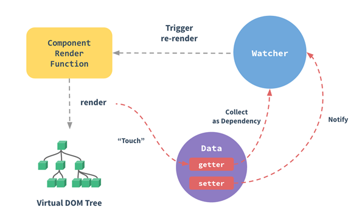

# 响应式原理

官方深入响应式原理文档 <https://cn.vuejs.org/v2/guide/reactivity.html>

每个组件实例都对应一个 watcher 实例，它会在组件渲染的过程中把“接触”过的数据属性记录为依赖。  
之后当依赖项的 setter 触发时，会通知 watcher，从而使它关联的组件重新渲染

Vue 在更新 DOM 时是异步执行的  
只要侦听到数据变化，Vue 将开启一个队列，并缓冲在同一事件循环中发生的所有数据变更  
在下一个的事件循环“tick”中，Vue 刷新队列并执行实际 (已去重的) 工作  
为了在数据变化之后等待 Vue 完成更新 DOM，可以在数据变化之后立即使用 Vue.nextTick(callback)，回调函数中的 this 将自动绑定到当前的 Vue 实例上  
$nextTick() 返回一个 Promise 对象，所以你可以使用新的 ES2017 async/await 语法  

造轮子: 简单版Vue  
<https://github.com/Leon522/vue-simple> 实现了数据绑定, 单文件  
<https://github.com/rocky-191/mvvm> 实现了数据绑定, class写法  
<https://github.com/RezelChen/miniVue> 似乎实现了VNode  

在底层实现中Vue会将模板编译成render()函数  
> 如果 render 函数和 template 属性都不存在，挂载 DOM 元素的 HTML 会被提取出来用作模板，此时，必须使用 Runtime + Compiler 构建的 Vue 库  
(<https://cn.vuejs.org/v2/api/#el>)  

> 每个组件实例都对应一个 watcher 实例，它会在组件渲染的过程中把“接触”过的数据属性记录为依赖。  
> 之后当依赖项的 setter 触发时，会通知 watcher，从而使它关联的组件重新渲染  
(<https://cn.vuejs.org/v2/guide/reactivity.html>)  

依赖收集的过程:  
<https://github.com/answershuto/learnVue/blob/master/docs/%E4%BE%9D%E8%B5%96%E6%94%B6%E9%9B%86.MarkDown>  

"重新渲染":  
缓冲在同一事件循环中发生的所有数据变更, 去重  
调用render()函数渲染出一个新的VNode, VNode与oldVNode进行diff, 然后patch更新DOM
